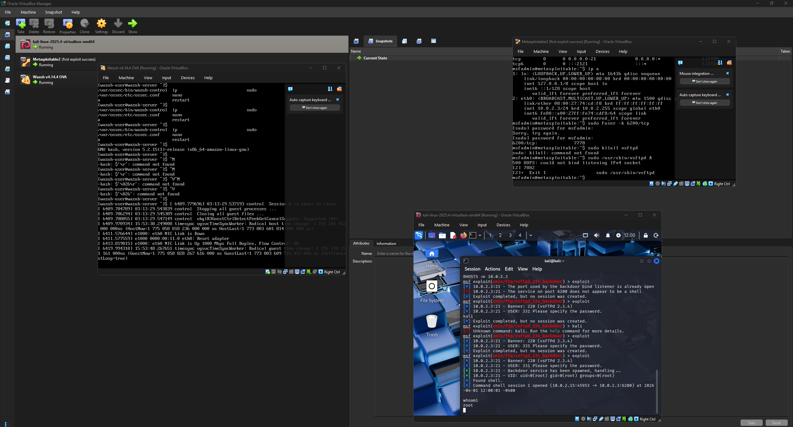
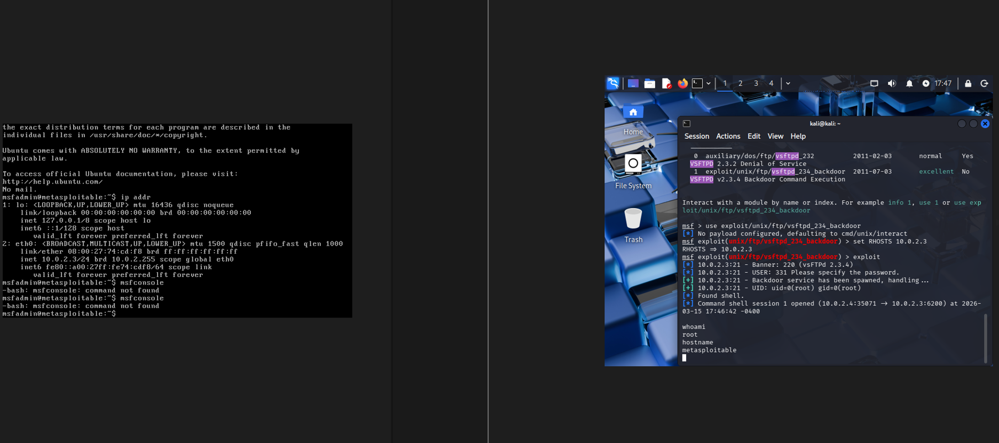
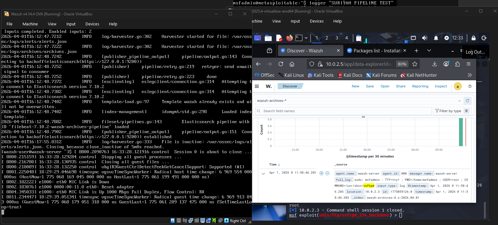
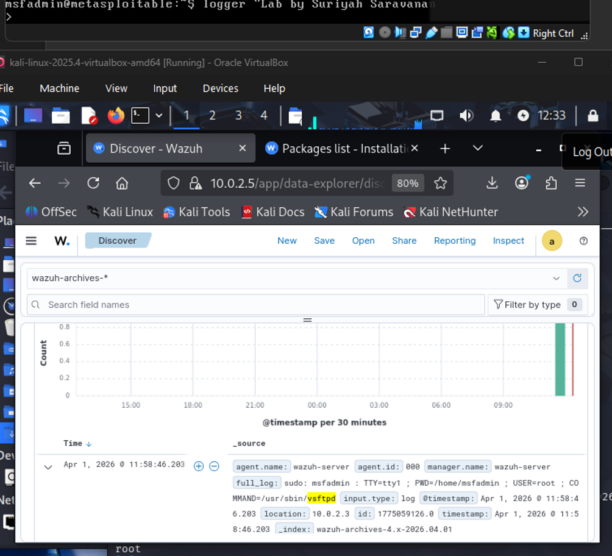

# Purple Team Lab: Attack & Detection Engineering
Author: Suriyah Saravanan Role: Security Researcher/Purple Team Analyst
---

## Lab Overview & Architecture

This project demonstrates the implementation of a full-stack security monitoring environment. The objective was to execute a Point-to-Point exploit and engineer custom detection rules within a SIEM to identify malicious activity in real-time.

    Blue Team (SIEM): Wazuh Manager & Indexer (v4.14) running on Ubuntu Server.

    Red Team (Attacker): Kali Linux utilizing the Metasploit Framework.

    Target (Victim): Metasploitable 2 (Linux-based vulnerable VM).

    Hypervisor: Oracle VirtualBox.
---
## Networking Configuration
To ensure a safe and contained testing environment, the lab utilized an isolated network topology:
* **Network Type:** Host-Only Adapter (VirtualBox).
* **Isolation:** All traffic was contained within the hypervisor, preventing any accidental exposure to the host machine or external internet.
* **IP Addressing:**
  * Attacker: `10.0.2.4`
  * Victim: `10.0.2.3`
  * SIEM: `10.0.2.5`
---
## Red Team Phase: The Exploit

Objective: Gain unauthorized root access to the target via a known backdoor.

    Vulnerability: vsftpd 2.3.4 Backdoor Command Execution.

    Payload: cmd/unix/interact.

    Execution: I utilized Metasploit to target the victim at 10.0.2.3. By exploiting a backdoor in the FTP service, I successfully spawned a root shell, allowing for full system compromise.
---
## Blue Team Phase: Detection & SIEM Analysis

Objective: Monitor the attack lifecycle and verify log integrity within the Wazuh SIEM.

    Log Ingestion: Configured Wazuh agents to monitor the victim's auth logs and system activity.

    Detection Strategy: I executed a custom "Pipeline Test" by injecting a uniquely tagged string (SURIYAH PIPELINE TEST) into the victim's logs using the logger command.

    SIEM Visualization: Verified that the Wazuh manager successfully parsed the log, categorized the event, and displayed the activity in the Discover dashboard.

    Incident Response: Identified the exploit attempt by monitoring for vsftpd service crashes and unexpected root-level shell spawns.
---
## The Purple Team Outcome

The value of this lab was the verification of the Security Pipeline.

    Attack: The Red Team established a point-to-point connection and achieved root.

    Telemetry: The Blue Team verified that the SIEM was not "blind" to the attack.

    Optimization: This lab provided the baseline for tuning Wazuh alerts to specifically flag vsftpd backdoor patterns and unauthorized sudo executions.
---
## Technical Evidence

### Lab Environment & Architecture

*Figure 1: Oracle VirtualBox orchestration showing the concurrent operation of Kali Linux (Attacker), Metasploitable (Victim), and Wazuh (SIEM).*

### Red Team: Exploit Execution

*Figure 2: Successful exploitation of the vsftpd 2.3.4 backdoor, resulting in a spawned root shell on the target system.*

### Blue Team: SIEM Telemetry & Log Ingestion

*Figure 3: Wazuh dashboard capturing real-time service activity and system logs from the victim machine.*

### Data Integrity Verification (Watermark)

*Figure 4: Custom log injection verified within the Wazuh Discover tab, confirming end-to-end telemetry integrity.*

---
## Lessons Learned & Future Improvements
* **Detection Tuning:** While the exploit was successful, the next phase involves engineering specific **Wazuh Decoders** to automatically flag the unique "backdoor" string pattern in the FTP traffic.
* **Persistence Testing:** Future iterations will include simulating "Living off the Land" (LotL) techniques to see if the SIEM can detect malicious activity that doesn't involve external malware.
* **Log Enrichment:** I plan to integrate **Sysmon** on the victim side to provide deeper granularity into process creation and network connections.

---
## Tech Stack

    SIEM: Wazuh (Elasticsearch/Filebeat/Kibana stack)

    Exploitation: Kali Linux / Metasploit

    Virtualization: Oracle VirtualBox / OVA management

    Networking: Host-only Adapters / Internal DHCP
